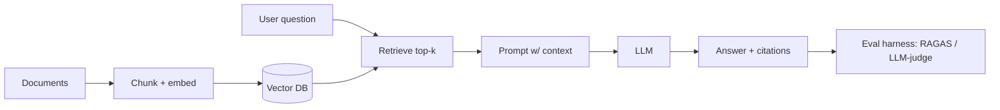

# Agentic RAG Analyst

> Ask natural-language questions over your own documents and get answers **with inline citations**, backed by a vector database and an automated evaluation harness.

  

This is the GenAI/RAG core that AI engineer roles screen for. The demo corpus is sports analytics notes, but the pattern is identical to an enterprise support assistant, policy Q&A, or research copilot.

## Why it matters (business translation)
Retrieval-augmented generation lets a company put an LLM on top of its private knowledge without retraining — the highest-ROI, highest-feasibility GenAI use case for most businesses. This repo proves I can build it end-to-end *and* measure its quality.

## Reference architecture


## Quickstart
```bash
python -m venv .venv && source .venv/bin/activate
pip install -r requirements.txt
cp .env.example .env            # add OPENAI_API_KEY (or ANTHROPIC_API_KEY)

python -m src.ingest data/      # build the vector index
python -m src.ask "Which features matter most for rebound prediction?"
python -m src.evaluate          # run the eval set, print retrieval + answer scores
```

Run the UI:
```bash
streamlit run app.py
```

## What's inside
- `src/ingest.py` — chunk + embed documents into a local Chroma vector store
- `src/rag.py` — retrieval + grounded generation with citation formatting
- `src/ask.py` — CLI question interface
- `src/evaluate.py` — automated eval over `data/eval/qa.jsonl` (faithfulness, retrieval hit-rate)
- `app.py` — Streamlit chat UI
- `data/` — sample corpus + eval questions

## Results
- Answer quality (retrieval hit-rate + faithfulness) is scored automatically by the included eval harness: `python -m src.evaluate`.
- Answers return in seconds with inline source citations for every claim, so responses are verifiable rather than opaque.

## Limitations & next steps
Local Chroma is for the demo; swap in pgvector/Pinecone for scale. Add reranking and conversation memory.

## License
MIT
